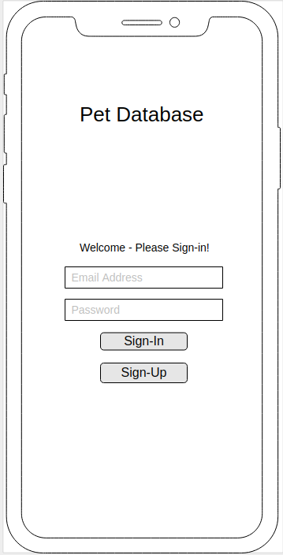
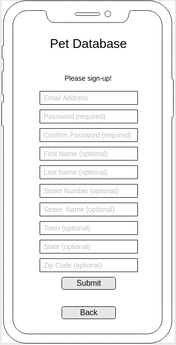
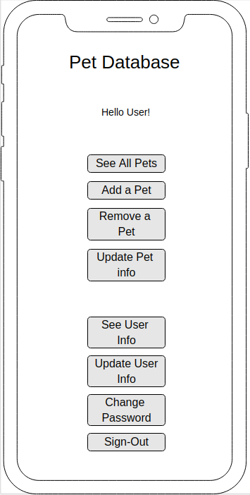
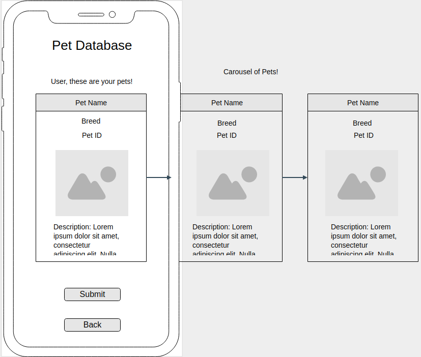
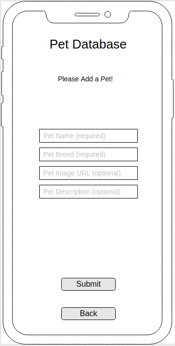
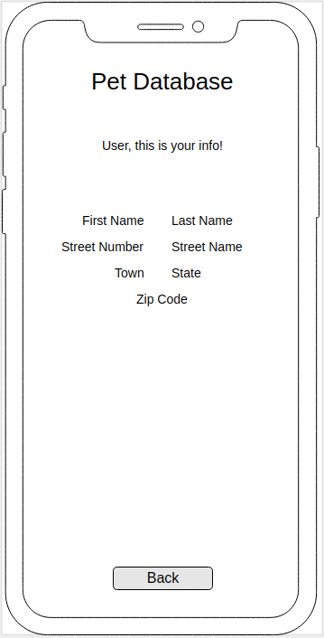
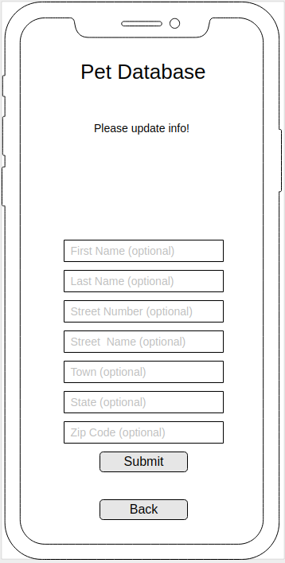
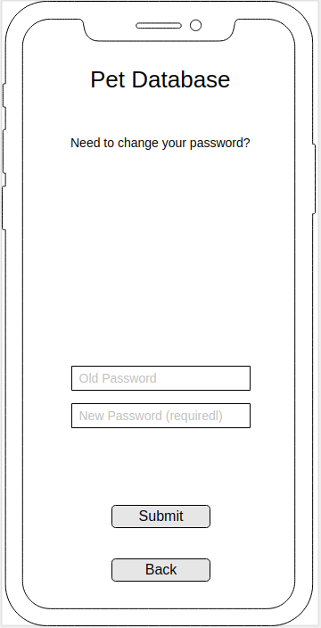

# Pet Sharing Application: The Client

I want to make a pet sharing database, so that you have multiple users and you can track the different pets that they have.

My wife works in, and manages, a pet store and we've been talking a lot recently about different things around her job. While a lot of the online aspects of her position are handed down from the corporate level I thought it would be interesting to try and craft something that could be relevant to what she does. This also could be used for my buddy's dog walking business so he can keep track of the various animals and households.

When coming up with an idea for what to track in a database per user I thought this would be something which would be useful information for the sales and marketing departments at the pet store, as well as a good way for a user to earn coupons and such (if implemented).

My actual implementation has been toned back a bit as it is mainly from a customer's perspective and for them to be able to enter their pet information and share it with other users.

## Important Links

- [Pet Client Repo](https://github.com/brinecr/pet-client)
- [Deployed API](https://protected-oasis-12032.herokuapp.com/)
- [Deployed Client](https://brinecr.github.io/pet-client/)

## Planning Story

Being as this is our second project I felt I had a stronger handle on planning this time around.

My initial plan broke it down by day:
Thursday: I plan on getting the auth section done on the front and back end (front end first).
Friday: I plan on getting the pet section done on the front and back end (front end first).
Saturday: I plan on continuing anything that was not finished previously.
Sunday: I plan on continuing anything that was not finished previously.
Monday: I hope to use this time to clean up my code, refactor, and clean up the HTML/CSS to look nice.

How this was actually implemented was a bit more of a wild ride. A big part that I had wanted to try was incorporating "Incorporate Bootstrap or some other front-end tool." I read this initially and asked myself - well what are other front end tools?

I ended up wasting my first day of the project incorporating a module called INK into my project. I got it to work but had issues with deployment and reached out to our instructional team about it - and it wasn't being supported since 2017. It was actually one of my biggest learning take-aways about this project was really how to incorporate something, when it's appropriate to, and how to actually check if something is still supported.

I got right back into things though and really ended up working on a lot of the front end basics for auth then went and got the back-end API done and then came back to integrate the front end for the pet section itself.

Because I lost a day initially I didn't get to playing around with as many stretch goals as I may have liked but I really like how things came together and how I managed my time.

### User Stories

1. As a pet owner I want to be able to log in and add my different pets to the database and then view all of my pets at once or just one at a time.
2. As a pet store marketing director I would like to see how many of each type of pet is in the database so we can see what products we should focus on marketing first (to our biggest audience of course!).
3. As a pet owner I would like to be able to see if my pet could win the pet of the month so I could get free stuff! (stretch goal)
4. As a dog walking business owner I want to see how many dogs have been entered within the last week to see if the business is growing!
5. As a groomer I would really like to see pictures of the dog so I can get them as close to that style as possible to make the owners happy. (stretch goal)
6. As a business owner I would like to be able to mail information and coupons to the people who have given me their information, so I would like to be able to see their full name and address easily!
7. As a pet food store manager I need to check how many cats have been added recently so I can make sure we have enough cat food!

### Technologies Used

1. html
1. CSS / sass
1. JavaScript
1. jQuery
1. Promise Chains
1. Handlers
1. Bootstrap
1. Handlebars
1. AJAX
1. Partials within Handlebars
1. Requiring other files
1. Wireframes
1. User Stories
1. Markup documentation
1. Mobile First Design
1. Use of Grunt Serve and Grunt Deploy
1. GitHub Integration w/ branch control
1. Integration with a custom API I created myself with Express

### Unsolved Problems

- Implementing a way to upload and show pictures would have been nice. This was/is top of my list for this application's stretch goals.
- I would have liked to be able to track more of the user information in addition to just the pet information. It's something I had on my initial wireframes but got toned back a bit in the planning process so I could hit the main requirements for the project.
- On a higher level, down the line, I'd like to make a seperate interface additions for some power users to manipulate more of the data. This would be regarding having a user who was able to track all of the types of dogs, or see how many other users there are - things like this which would be important for a business to track. Different GET command filters and such. This would incorporate into the API but having additional objects needing to be tracked and manipulated.

## Images

---
### ERD (entity relationship diagram)

#### Wireframe:

