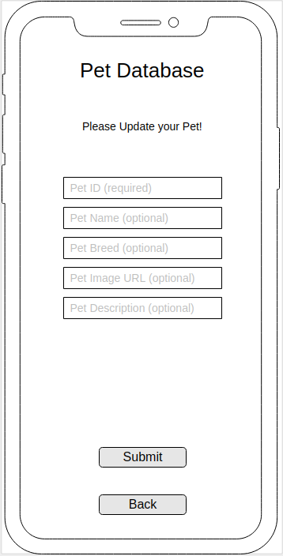
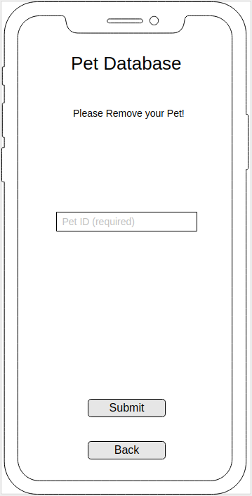

# Pet Tracker Application: The Client

I want to make a pet tracking database, so that you have multiple users and you can track the different pets that they have.

My wife works in and manages a pet store and we've been talking a lot recently about different things around her job. While a lot of the online aspects of her position are handed down from the corporate level I thought it would be interesting to try and craft something that could be relevant to what she does.

I also thought of it in regards to a friend's dog walking business. This would allow him to track the users and their pets.

I tried to think of how this would be useful from a business perspective as well as clients. You can incorporate coupons and mailing information if you track users and the pet info let's you know what to market towards.

My actual implementation has been toned back a bit as it is mainly from a customer's perspective and for them to be able to enter their pet information.

## Important Links

- [Pet API Repo](https://github.com/brinecr/pet-api)
- [Deployed API](https://protected-oasis-12032.herokuapp.com/)
- [Deployed Client](https://brinecr.github.io/pet-client/)

## Planning Story

Being as this is our second project I felt I had a stronger handle on planning this time around.

### User Stories

1. As a pet owner I want to be able to log in and add my different pets to the database and then view all of my pets at once or just one at a time.
2. As a pet store marketing director I would like to see how many of each type of pet is in the database so we can see what products we should focus on marketing first (to our biggest audience of course!).
3. As a pet owner I would like to be able to see if my pet could win the pet of the month so I could get free stuff! (stretch goal)
4. As a dog walking business owner I want to see how many dogs have been entered within the last week to see if the business is growing!
5. As a groomer I would really like to see pictures of the dog so I can get them as close to that style as possible to make the owners happy. (stretch goal)
6. As a business owner I would like to be able to mail information and coupons to the people who have given me their information, so I would like to be able to see their full name and address easily!
7. As a pet food store manager I need to check how many cats have been added recently so I can make sure we have enough cat food!

### Technologies Used

1. html
1. CSS / sass
1. JavaScript
1. jQuery
1. API integration
1. Bootstrap
1. Handlebars
1. Ink
1. Font Awesome
1. Wireframes
1. User Stories
1. Markup documentation
1. Mobile First Design
1. Use of Grunt Serve and Grunt Deploy
1. GitHub Integration w/ branch control

### Unsolved Problems

- I would have liked to be able to track more of the user information in addition to just the pet information. It's something I had on my initial wireframes but got toned back a bit in the planning process so I could hit the main requirements for the project.
- On a higher level, down the line, I'd like to make a seperate interface additions for some power users to manipulate more of the data. This would be regarding having a user who was able to track all of the types of dogs, or see how many other users there are - things like this which would be important for a business to track. This would incorporate into the API but having additional objects needing to be tracked and manipulated.

## Images

---
### ERD (entity relationship diagram)

#### Wireframe:

